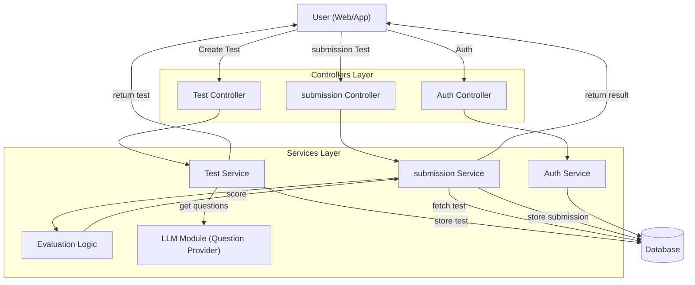

# Architecture

## Latest Version

```mermaid
flowchart TD

    %% USER
    user["User (Web/App)"]

    %% CONTROLLERS
    subgraph controllers["Controllers Layer"]
        testCtrl["Test Controller"]
        submissionCtrl["submission Controller"]
        authCtrl["Auth Controller"]
    end

    %% SERVICES
    subgraph services["Services Layer"]
        testService["Test Service"]
        submissionService["submission Service"]
        evalService["Evaluation Logic"]
        llmService["LLM Module (Question Provider)"]
        authService["Auth Service"]

    end

    %% DATABASE
    db[(Database)]

    %% USER FLOW
    user -->|"Create Test"| testCtrl
    user -->|"submission Test"| submissionCtrl
    user -->|"Auth"| authCtrl

    %% TEST FLOW
    testCtrl --> testService
    testService -->|"get questions"| llmService
    testService -->|"store test"| db
    testService -->|"return test"| user

    %% submission FLOW
    submissionCtrl --> submissionService
    submissionService -->|"fetch test"| db
    submissionService --> evalService
    evalService -->|"score"| submissionService
    submissionService -->|"store submission"| db
    submissionService -->|"return result"| user

    %% AUTH FLOW
    authCtrl --> authService
    authService --> db
```
