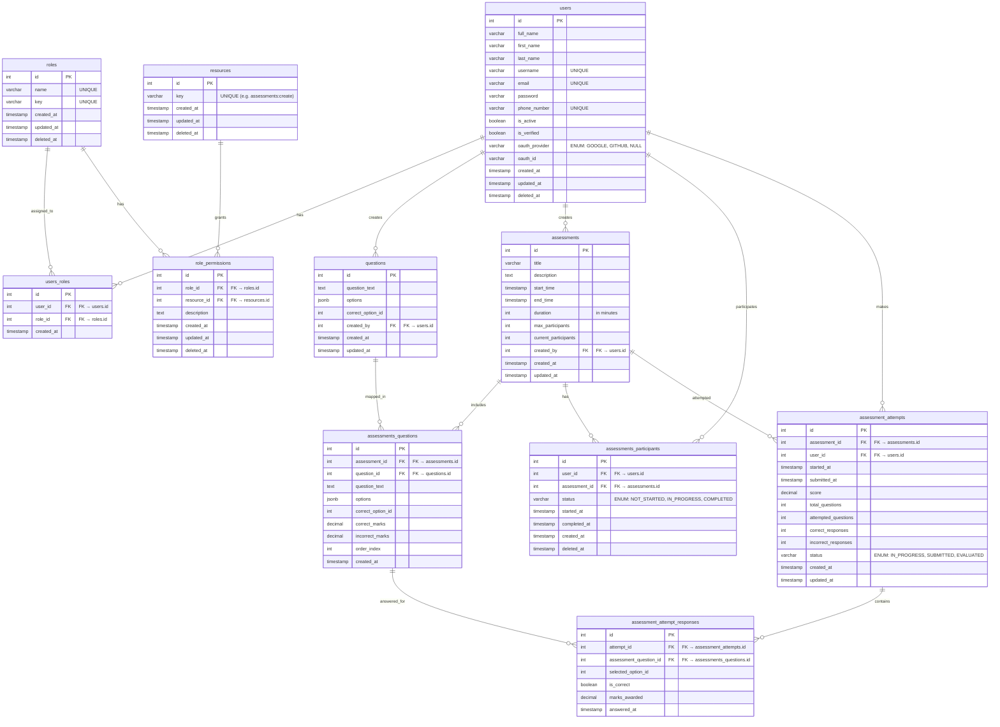

# Entity Relationship Diagram (ERD)

This page documents the evolution of the TestFlow database schema. The most recent version is v2.2.1.

## Latest Version

```mermaid
erDiagram

    users {
        int id PK
        varchar full_name
        varchar first_name
        varchar last_name
        varchar username "UNIQUE"
        varchar email "UNIQUE"
        varchar password
        varchar phone_number "UNIQUE"
        boolean is_active
        boolean is_verified
        varchar oauth_provider "ENUM: GOOGLE, GITHUB, NULL"
        varchar oauth_id
        timestamp created_at
        timestamp updated_at
        timestamp deleted_at
    }

    roles {
        int id PK
        varchar name "UNIQUE"
        varchar key "UNIQUE"
        timestamp created_at
        timestamp updated_at
        timestamp deleted_at
    }

    users_roles {
        int id PK
        int user_id FK "FK → users.id"
        int role_id FK "FK → roles.id"
        timestamp created_at
    }

    resources {
        int id PK
        varchar key "UNIQUE (e.g. assessments:create)"
        timestamp created_at
        timestamp updated_at
        timestamp deleted_at
    }

    role_permissions {
        int id PK
        int role_id FK "FK → roles.id"
        int resource_id FK "FK → resources.id"
        text description
        timestamp created_at
        timestamp updated_at
        timestamp deleted_at
    }

    assessments {
        int id PK
        varchar title
        text description
        timestamp start_time
        timestamp end_time
        int duration "in minutes"
        int max_participants
        int current_participants
        int created_by FK "FK → users.id"
        timestamp created_at
        timestamp updated_at
    }

    questions {
        int id PK
        text question_text
        jsonb options
        int correct_option_id
        int created_by FK "FK → users.id"
        timestamp created_at
        timestamp updated_at
    }

    assessments_questions {
        int id PK
        int assessment_id FK "FK → assessments.id"
        int question_id FK "FK → questions.id"

        text question_text
        jsonb options
        int correct_option_id

        decimal correct_marks
        decimal incorrect_marks

        int order_index

        timestamp created_at
    }

    assessments_participants {
        int id PK
        int user_id FK "FK → users.id"
        int assessment_id FK "FK → assessments.id"
        varchar status "ENUM: NOT_STARTED, IN_PROGRESS, COMPLETED"
        timestamp started_at
        timestamp completed_at
        timestamp created_at
        timestamp deleted_at
    }


    assessment_attempts {
        int id PK
        int assessment_id FK "FK → assessments.id"
        int user_id FK "FK → users.id"

        timestamp started_at
        timestamp submitted_at

        decimal score
        int total_questions
        int attempted_questions
        int correct_responses
        int incorrect_responses

        varchar status "ENUM: IN_PROGRESS, SUBMITTED, EVALUATED"

        timestamp created_at
        timestamp updated_at
    }

    assessment_attempt_responses {
        int id PK
        int attempt_id FK "FK → assessment_attempts.id"
        int assessment_question_id FK "FK → assessments_questions.id"

        int selected_option_id

        boolean is_correct
        decimal marks_awarded

        timestamp answered_at
    }

    %% Auth relationships
    users ||--o{ users_roles : has
    roles ||--o{ users_roles : assigned_to

    roles ||--o{ role_permissions : has
    resources ||--o{ role_permissions : grants

    %% Question bank relationships
    users ||--o{ questions : creates

    %% assessment relationships
    users ||--o{ assessments : creates

    assessments ||--o{ assessments_questions : includes
    questions ||--o{ assessments_questions : mapped_in

    %% Participant relationships
    users ||--o{ assessments_participants : participates
    assessments ||--o{ assessments_participants : has


    %% Attempt relationships
    users ||--o{ assessment_attempts : makes
    assessments ||--o{ assessment_attempts : attempted

    assessment_attempts ||--o{ assessment_attempt_responses : contains
    assessments_questions ||--o{ assessment_attempt_responses : answered_for

```