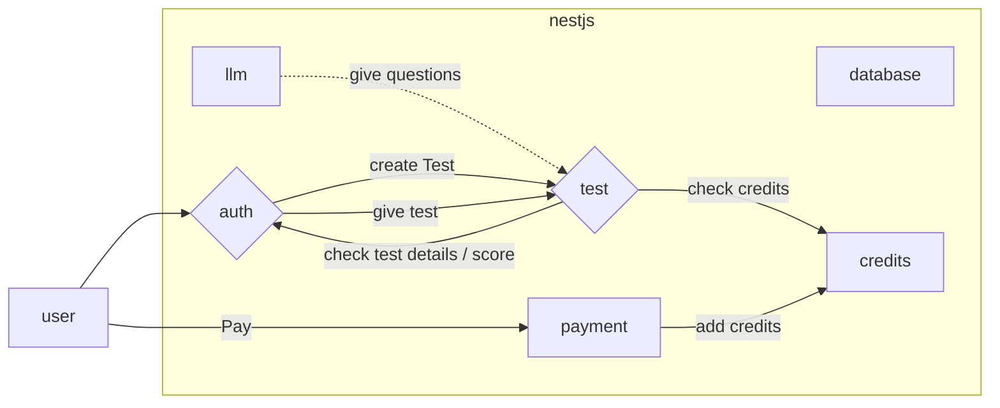

# Architecture

## v2

```mermaid
flowchart LR
    user["User"]

    subgraph backend["NestJS Backend (Modular Monolith)"]
        auth["Auth Module"]
        test["Test Module"]
        attempt["Attempt Module"]
        evaluation["Evaluation Logic"]
        llm["LLM Module (Question Provider)"]
    end

    db[(Database)]

    user -->|"Create / Give Test"| test
    test -->|"fetch questions"| llm
    test --> db

    user -->|"Submit Answers"| attempt
    attempt --> evaluation
    evaluation --> db

    auth -.-> test
    auth -.-> attempt
```

## v1

```mermaid
flowchart LR
    user["user"]

    subgraph nestjs["nestjs"]
        database["database"]
        llm["llm"]
        auth{"auth"}
        test{"test"}
        credits["credits"]
        payment["payment"]
    end

    user --> auth
    auth -->|"create Test"| test
    auth -->|"give test"| test
    llm -.->|"give questions"| test
    test -->|"check credits"| credits
    test -->|"check test details / score"| auth
    user -->|"Pay"| payment
    payment -->|"add credits"| credits
```
