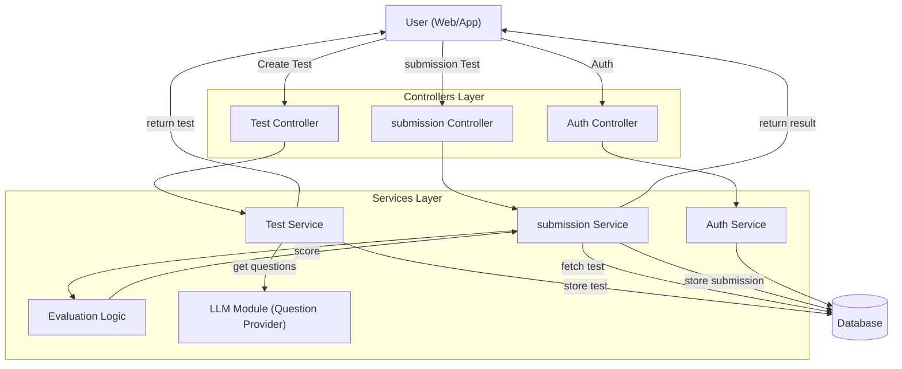
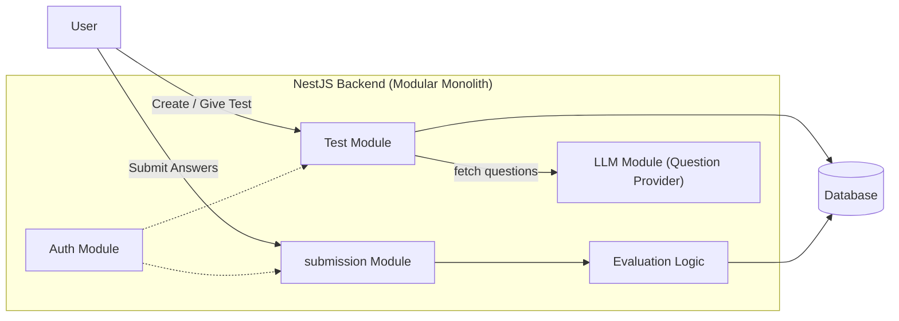
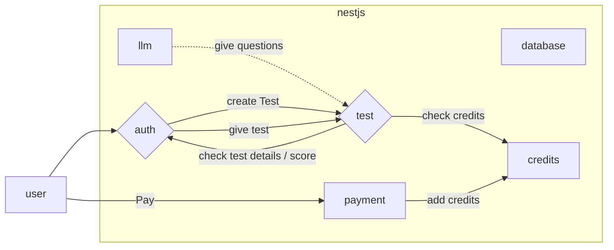

# Architecture

## Version History

### v2.1.0

```mermaid
flowchart TD

    %% USER
    user["User (Web/App)"]

    %% CONTROLLERS
    subgraph controllers["Controllers Layer"]
        testCtrl["Test Controller"]
        submissionCtrl["submission Controller"]
        authCtrl["Auth Controller"]
    end

    %% SERVICES
    subgraph services["Services Layer"]
        testService["Test Service"]
        submissionService["submission Service"]
        evalService["Evaluation Logic"]
        llmService["LLM Module (Question Provider)"]
        authService["Auth Service"]

    end

    %% DATABASE
    db[(Database)]

    %% USER FLOW
    user -->|"Create Test"| testCtrl
    user -->|"submission Test"| submissionCtrl
    user -->|"Auth"| authCtrl

    %% TEST FLOW
    testCtrl --> testService
    testService -->|"get questions"| llmService
    testService -->|"store test"| db
    testService -->|"return test"| user

    %% submission FLOW
    submissionCtrl --> submissionService
    submissionService -->|"fetch test"| db
    submissionService --> evalService
    evalService -->|"score"| submissionService
    submissionService -->|"store submission"| db
    submissionService -->|"return result"| user

    %% AUTH FLOW
    authCtrl --> authService
    authService --> db
```

### v2

```mermaid
flowchart LR
    user["User"]

    subgraph backend["NestJS Backend (Modular Monolith)"]
        auth["Auth Module"]
        test["Test Module"]
        submission["submission Module"]
        evaluation["Evaluation Logic"]
        llm["LLM Module (Question Provider)"]
    end

    db[(Database)]

    user -->|"Create / Give Test"| test
    test -->|"fetch questions"| llm
    test --> db

    user -->|"Submit Answers"| submission
    submission --> evaluation
    evaluation --> db

    auth -.-> test
    auth -.-> submission
```

### v1

```mermaid
flowchart LR
    user["user"]

    subgraph nestjs["nestjs"]
        database["database"]
        llm["llm"]
        auth{"auth"}
        test{"test"}
        credits["credits"]
        payment["payment"]
    end

    user --> auth
    auth -->|"create Test"| test
    auth -->|"give test"| test
    llm -.->|"give questions"| test
    test -->|"check credits"| credits
    test -->|"check test details / score"| auth
    user -->|"Pay"| payment
    payment -->|"add credits"| credits
```
