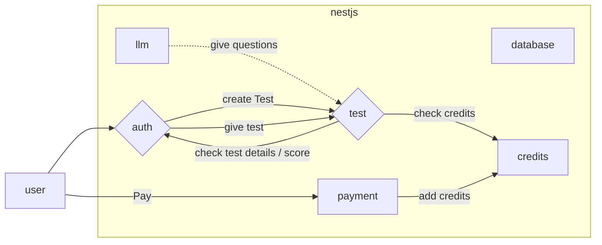

# Architecture

## v1

```mermaid
flowchart LR
    user["user"]

    subgraph nestjs["nestjs"]
        database["database"]
        llm["llm"]
        auth{"auth"}
        test{"test"}
        credits["credits"]
        payment["payment"]
    end

    user --> auth
    auth -->|"create Test"| test
    auth -->|"give test"| test
    llm -.->|"give questions"| test
    test -->|"check credits"| credits
    test -->|"check test details / score"| auth
    user -->|"Pay"| payment
    payment -->|"add credits"| credits
```
