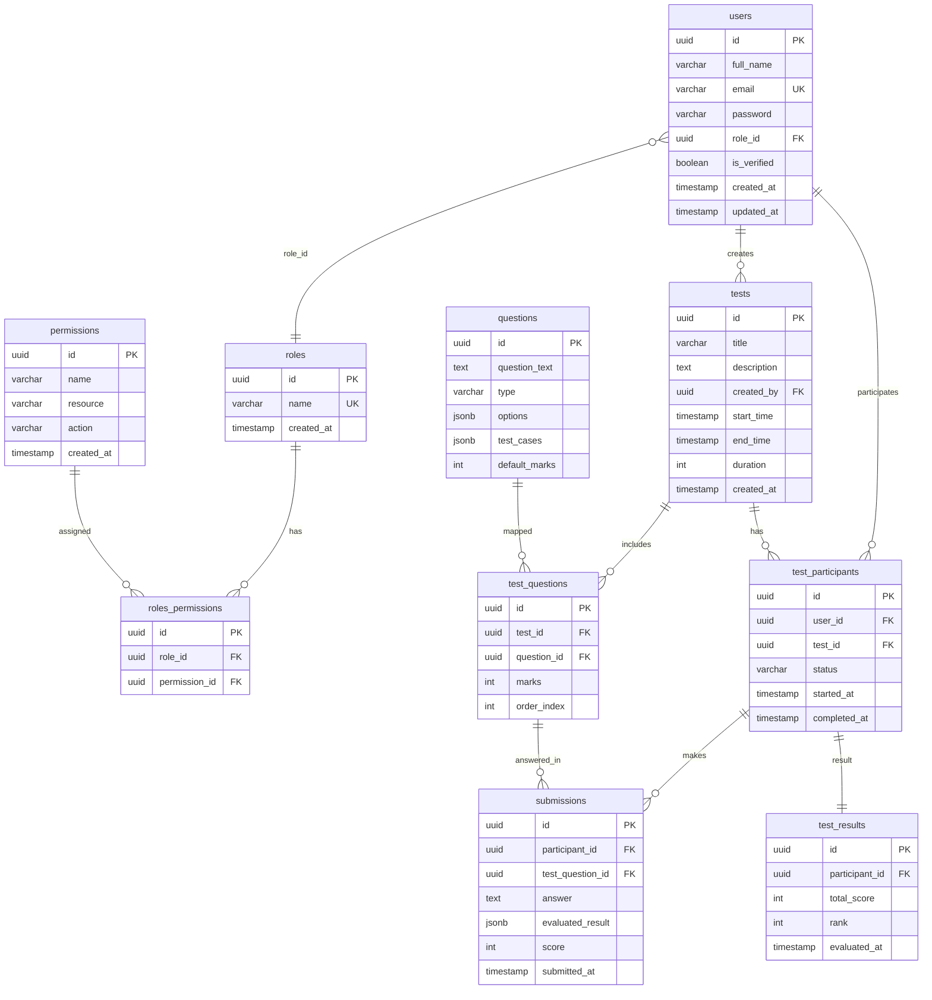

```mermaid
erDiagram

    users {
        uuid id PK
        varchar full_name
        varchar email UK
        varchar password
        uuid role_id FK
        boolean is_verified
        timestamp created_at
        timestamp updated_at
    }

    roles {
        uuid id PK
        varchar name UK
        timestamp created_at
    }

    permissions {
        uuid id PK
        varchar name
        varchar resource
        varchar action
        timestamp created_at
    }

    roles_permissions {
        uuid id PK
        uuid role_id FK
        uuid permission_id FK
    }

    tests {
        uuid id PK
        varchar title
        text description
        uuid created_by FK
        timestamp start_time
        timestamp end_time
        int duration
        timestamp created_at
    }

    questions {
        uuid id PK
        text question_text
        varchar type
        jsonb options
        jsonb test_cases
        int default_marks
    }

    test_questions {
        uuid id PK
        uuid test_id FK
        uuid question_id FK
        int marks
        int order_index
    }

    test_participants {
        uuid id PK
        uuid user_id FK
        uuid test_id FK
        varchar status
        timestamp started_at
        timestamp completed_at
    }

    submissions {
        uuid id PK
        uuid participant_id FK
        uuid test_question_id FK
        text answer
        jsonb evaluated_result
        int score
        timestamp submitted_at
    }

    test_results {
        uuid id PK
        uuid participant_id FK
        int total_score
        int rank
        timestamp evaluated_at
    }

    %% AUTH RELATIONSHIPS
    users }o--|| roles : "role_id"
    roles ||--o{ roles_permissions : "has"
    permissions ||--o{ roles_permissions : "assigned"

    %% TEST FLOW
    users ||--o{ tests : creates
    users ||--o{ test_participants : participates

    tests ||--o{ test_questions : includes
    tests ||--o{ test_participants : has

    questions ||--o{ test_questions : mapped

    test_participants ||--o{ submissions : makes
    test_questions ||--o{ submissions : answered_in

    test_participants ||--|| test_results : result
```
